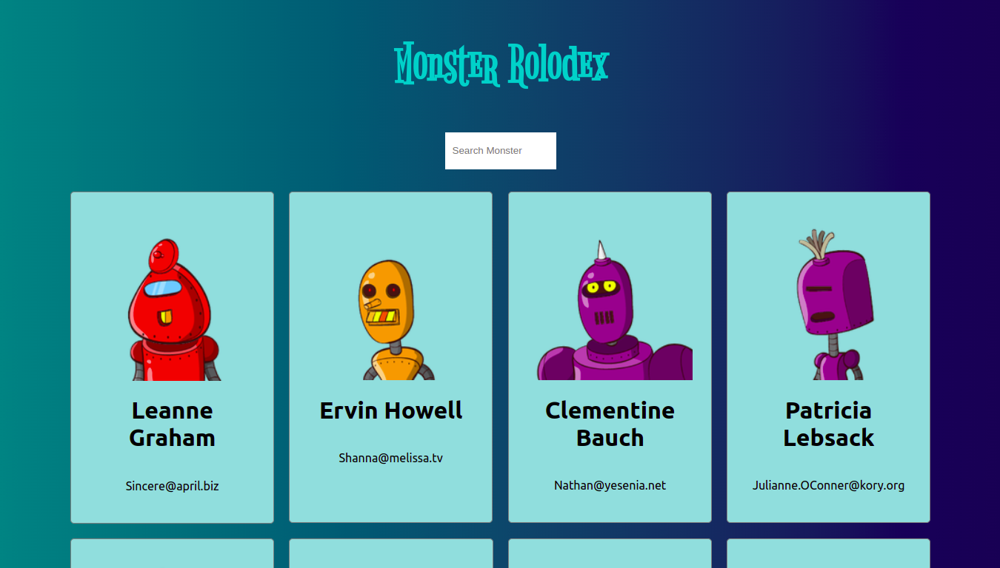
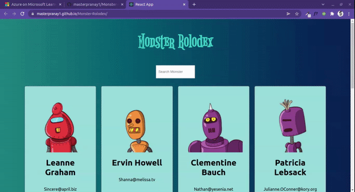

# Monster Rolodex App
This is tutorial project from my React Course.
Placeholder api was used to fetch out the names and the email.

 

[Live Link](https://masterpranay1.github.io/Monster-Rolodex/)
[Course Link -> Zero to Hero Mastery Complete React Developer ](https://www.udemy.com/course/complete-react-developer-zero-to-mastery/)

## Homeapage

## Filter Feature

## My New Learning

1. Create React App 
    - What is `npx` ?
    - How its different from `npm` ?
    - What actually is CRA ?

2. JSX
    - How its different from javascript ?
    - How naming is done in JSX like insead of dash we are using camelCase and others.

3. Function Component And Class Component
    - Difference between there structure
    - Automatic binding in ES6 `Arrow function`
    - When to use which one ?

4. React State
    - What is state ?
    - Uni - Directional Data Flow
    - How to update them using `setState`

5. Props
    - Some Special props in react

6. Life Cycle Methods
    - What are different life cycle methods?
    - why are they needed ?
    - When they are invoked ?

7. Building and Pushing to Github Pages
    - gh-pages library was used and hosted through the teminal

## Why React

I understood why react is needed and what the perks of using it.
What is a `SPA` ( Single Page Application ) ?
How Rendering is done in React ?
Why React Follows a Uni Directional Data Flow ?

## Author

Hey!! I am Pranay Raj. I am passionate in Web Devlopment and Making Creative Projects is like my hobby :)

You can connect me:

 